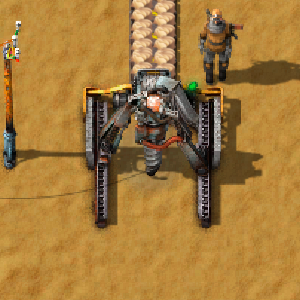

<p align="center">
  
</p>

<p align="center">
  <a href="https://github.com/ZwerOxotnik/factorio-minable_tiles/tags">
    
  </a>
  <a href="https://github.com/ZwerOxotnik/factorio-minable_tiles/stargazers">
    
  </a>
  <a href="https://discordapp.com/invite/YyJVUCa">
    
  <br/>
  <a href="https://www.patreon.com/ZwerOxotnik">
    
  <a href="https://ko-fi.com/zweroxotnik">
    
  <a href="http://github.com/ZwerOxotnik/factorio-minable_tiles/fork">
    
  </a>
</p>

<p align="center">
</p>


**Minable tiles**

Mining drills can mine tiles now.\
Customizable during the game, no restart requires.\
Should be compatible with any mod, otherwire report or write a request.\
Very low impact on UPS.

<p align="center">
<a href="https://mods.factorio.com/mod/minable_tiles/downloads"><strong>Download the mod&nbsp;&nbsp;▶</strong></a>
</p>


‼️ Important Links (Translations, Discord Support)
---------------------------------------------------------------

| Installation Guide | Translations | Discord |
| ------------------ | ------------ | ------- |
| 📖 [Installation Guide](https://wiki.factorio.com/index.php?title=Installing_Mods) | 📚 [Help with translations](https://crowdin.com/project/factorio-mods-localization) | 🦜 [Discord](https://discord.gg/zYTM3rZM4T) |

If you want to download from this source, then use commands below (requires [git](https://git-scm.com/downloads)).

```bash
git clone https://github.com/ZwerOxotnik/factorio-minable_tiles
cd factorio-minable_tiles
```

[Contributing](/CONTRIBUTING.md)
--------------------------------

Don't be afraid to contribute! We have many, many things you can do to help out. If you're trying to contribute but stuck, tag @ZwerOxotnik

Alternatively, join the [Discord group](https://discordapp.com/invite/YyJVUCa) and send a message there.

Please read the [contributing file](/CONTRIBUTING.md) for other details on how to contribute.


License
-------
Copyright (c) 2022 ZwerOxotnik \<zweroxotnik@gmail.com\>

Use of the source code included here is governed by the Apache License, Version 2.0. See the [LICENSE](/LICENSE) file for details.

[homepage]: http://mods.factorio.com/mod/factorio-minable_tiles
[ZwerOxotnik]: github.com/ZwerOxotnik/
